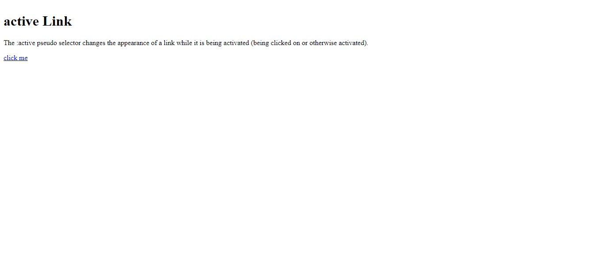
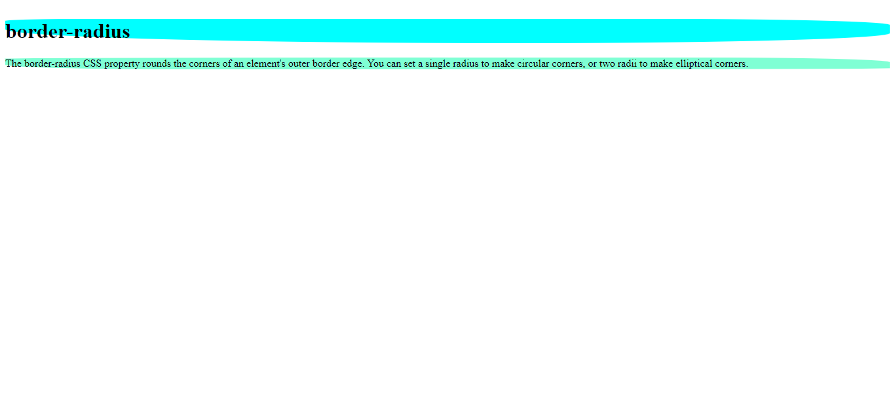

# CSS Learning

## selectors in css

[first](./first-css-index.html)

## CSS Position Absolute

An element with position: absolute; is positioned relative to the nearest positioned ancestor (instead of positioned relative to the viewport, like fixed)
[Absolute.html](./absolute_position.html)

## CSS Link Active

The :active CSS pseudo-class represents an element (such as a button) that is being activated by the user. When using a mouse, "activation" typically starts when the user presses down the primary mouse button.

[Active.html](./active.html)

## CSS border radius

The border-radius CSS property rounds the corners of an element's outer border edge. You can set a single radius to make

[BorderRadius.html](./border-radius.html)
