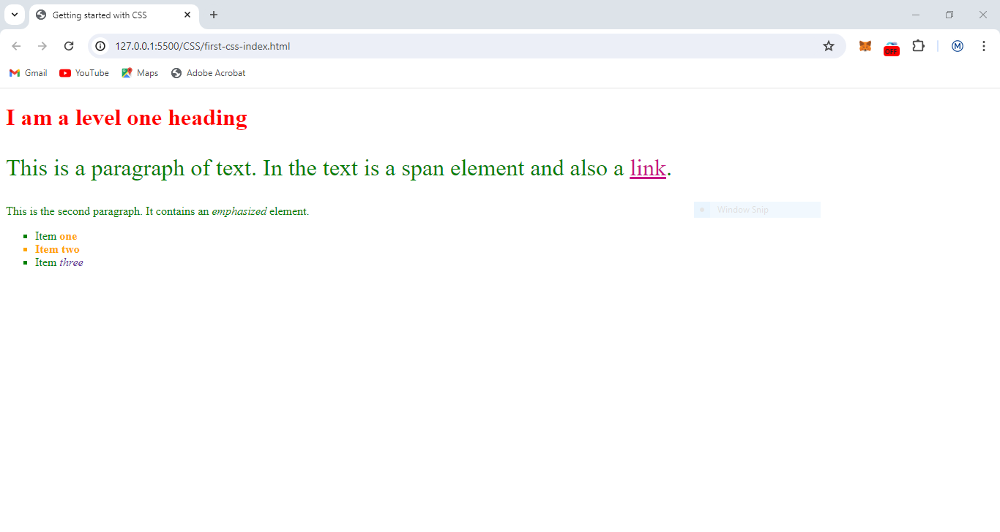

# CSS Learning

## selectors in css

[first](./first-css-index.html)

## CSS Position Absolute

An element with position: absolute; is positioned relative to the nearest positioned ancestor (instead of positioned relative to the viewport, like fixed)
[Absolute.html](./absolute_position.html)

