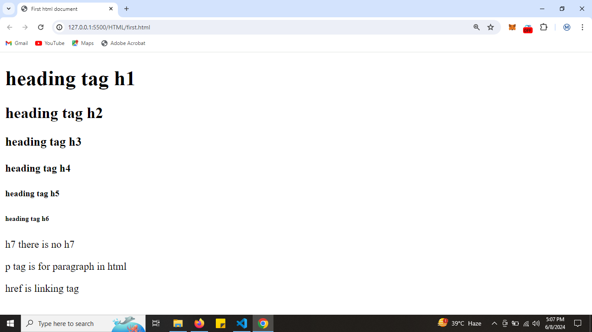
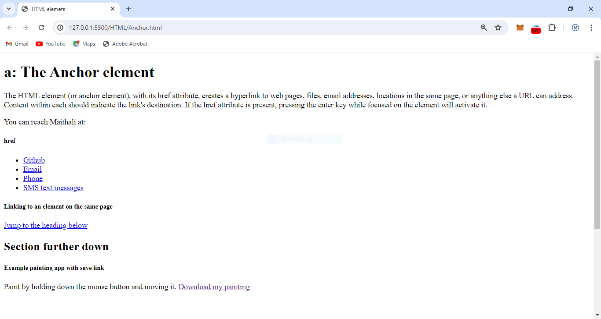
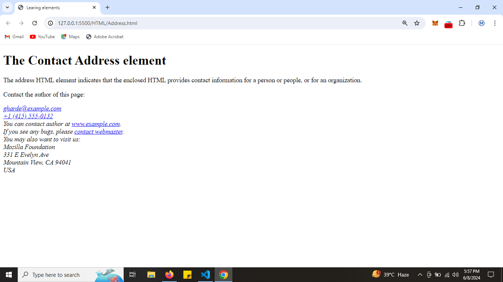
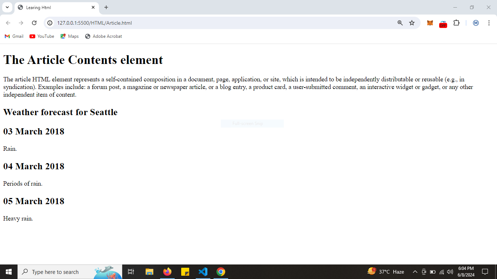
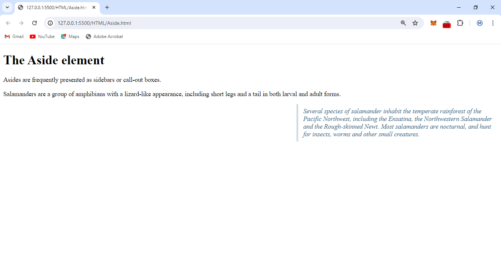
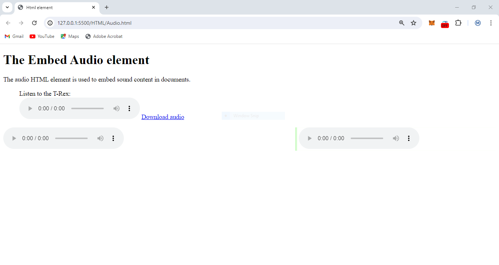
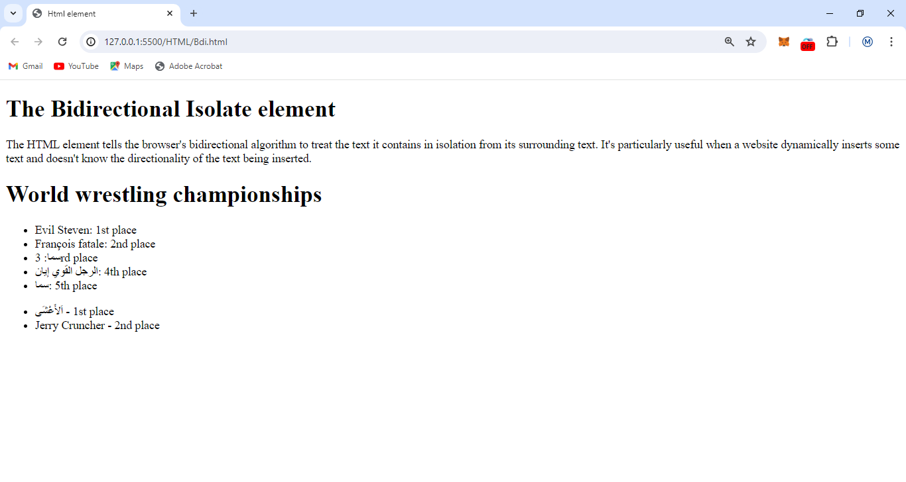

# All HTML Learning

## getting familar with html

[first.html](./first.html)

[Anchor.html](./Anchor.html)

[Abbreviation](./Abbreviation.html)
[address](./Address.html)

[Artilce](./Article.html)

[Aside](./Aside.html)

[Audio](./Audio.html)

[Base](./Base.html)
[Bdi](./Bdi.html)

