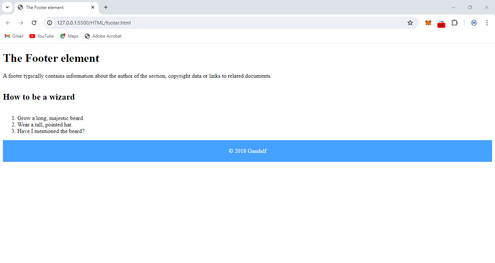
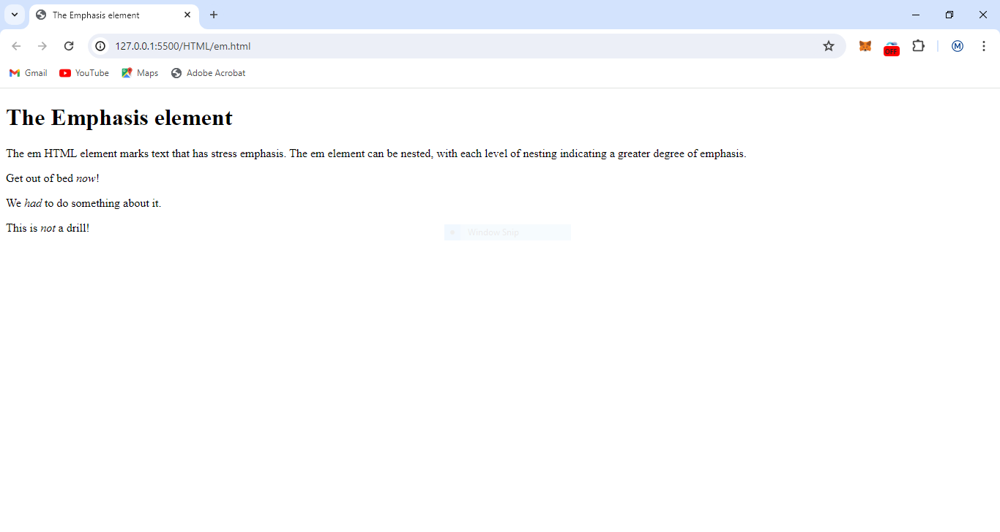
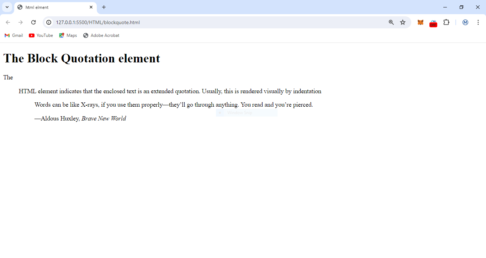
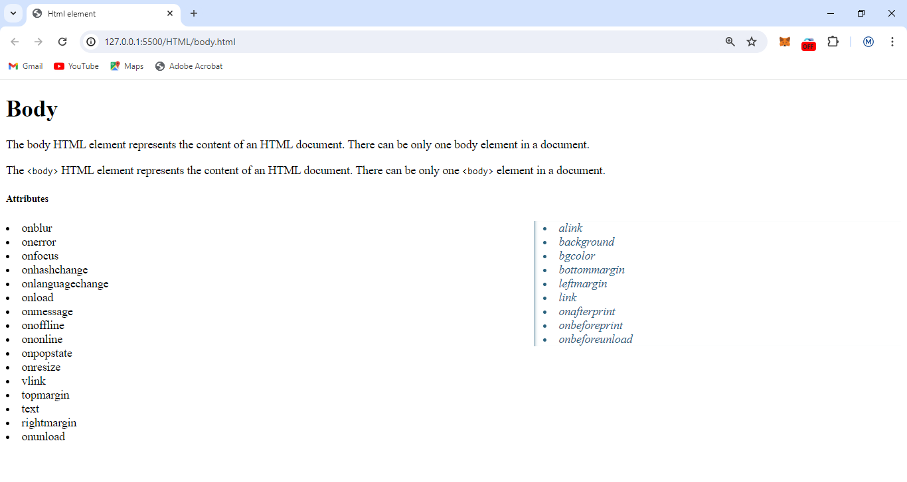
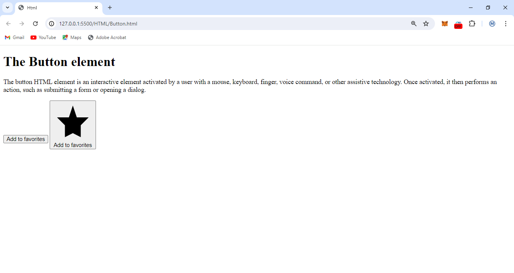
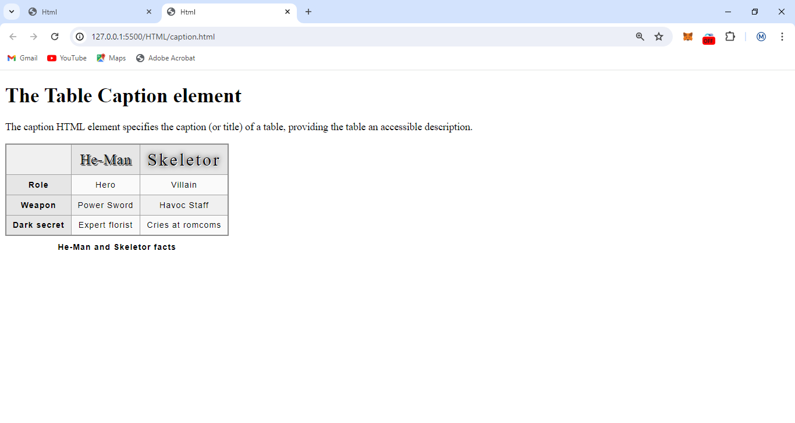
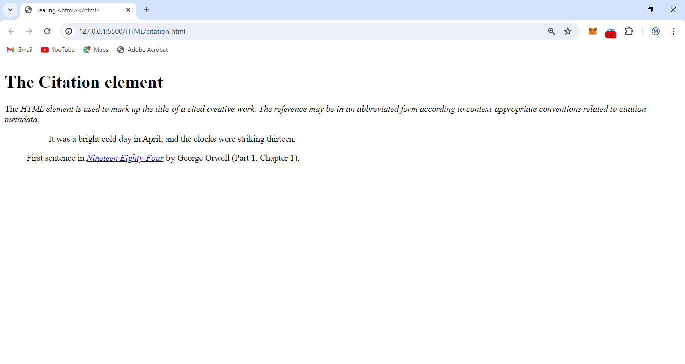
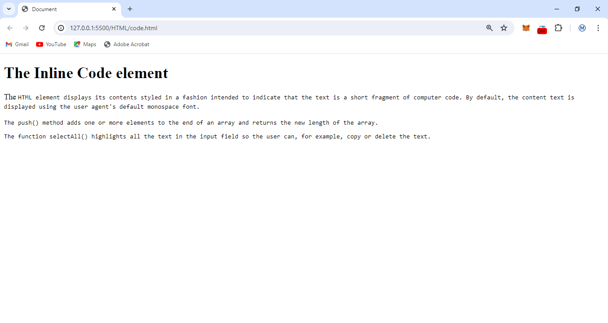
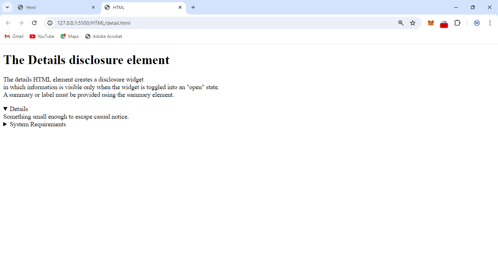
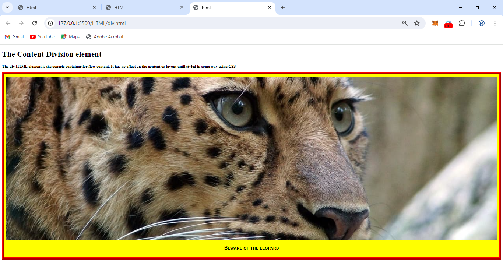

# All HTML Learning

## getting familar with html

[footer](./footer.html)

[fieldset](./fieldset.html)

[em](./em.html)

[first.html](./first.html)

[Anchor.html](./Anchor.html)

[Abbreviation](./Abbreviation.html)
[address](./Address.html)

[Artilce](./Article.html)

[Aside](./Aside.html)

[Audio](./Audio.html)

[Base](./Base.html)
[Bdi](./Bdi.html)

[Blockquote](./blockquote.html)

[body](./body.html)

[Break](./break.html)
[Button](./Button.html)

[caption](./caption.html)

[cite](./citation.html)

[code](./code.html)

[delete](./delete.html)

[detail](./detail.html)

[div](./div.html)

