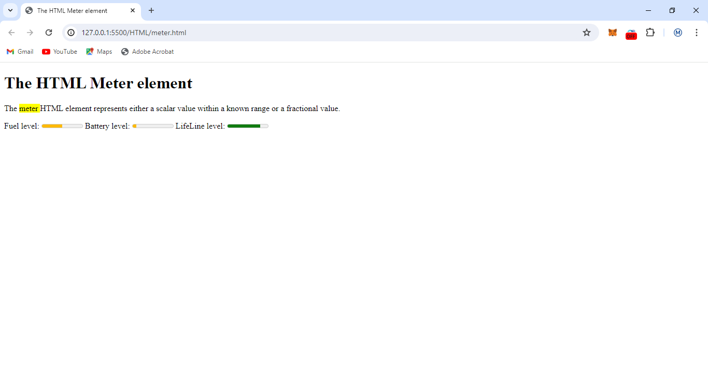
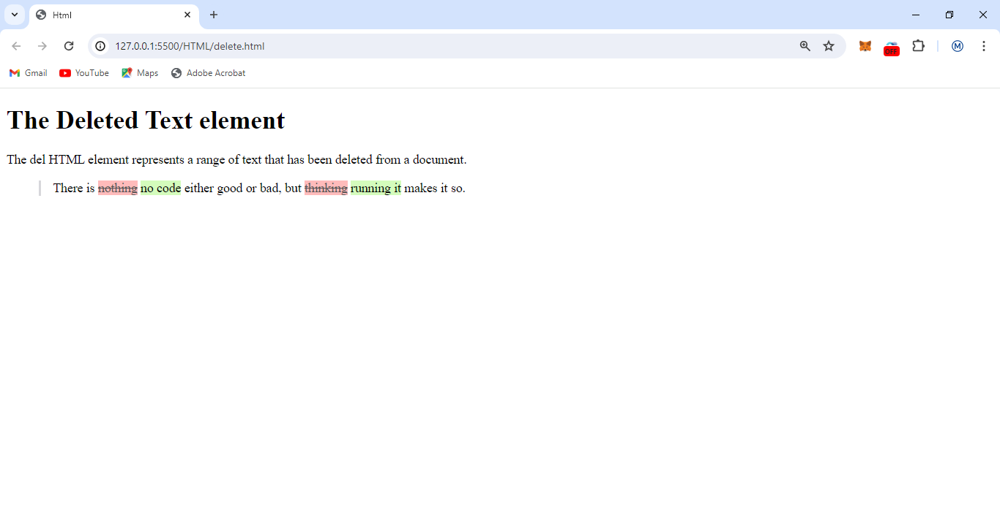

# Course: HyperText Markup Language

## 📓getting familar with html

### AccessKey

The attribute value must consist of a single printable character.

[Accesskey](./accesskey.html)

### Track

The <track> tag specifies text tracks for <audio> or <video> elements.

This element is used to specify subtitles, caption files or other files containing text, that should be visible when the media is playing.

Tracks are formatted in WebVTT format (.vtt files).

[Track](./track.html)

###

[Table](./table.html)

[Summary](./summary.html)

[Pre](./pre.html)

[Option](./option.html)
[OptGroup](./optGroup.html)
[Nav](./nav.html)

[Meter](./meter.html)

[Meta](./meta.html)

[mark](./mark.html)
[list](./list.html)

[Label](./label.html)
[input](./input.html)

[img](./img.html)

[iframe](./iframe.html)

[head](./head.html)
[idiomatic](./i.html)
[Form](./form.html)

[footer](./footer.html)

[fieldset](./fieldset.html)

[em](./em.html)

[first.html](./first.html)

[Anchor.html](./Anchor.html)

[Abbreviation](./Abbreviation.html)
[address](./Address.html)

[Artilce](./Article.html)

[Aside](./Aside.html)

[Audio](./Audio.html)

[Base](./Base.html)
[Bdi](./Bdi.html)

[Blockquote](./blockquote.html)

[body](./body.html)

[strikethrough](./strikethrough.html)

[Break](./break.html)
[Button](./Button.html)

[caption](./caption.html)

[cite](./citation.html)

[code](./code.html)

[delete](./delete.html)

[detail](./detail.html)

[div](./div.html)

