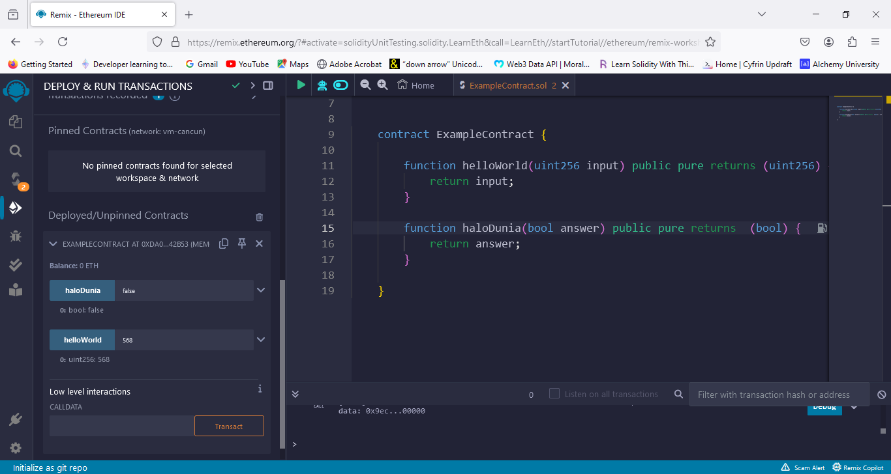

# All Solidity Learning

## getting familar with solidity

### Smart Contracts

[Arithmetic](./Arithematic.sol) |[ArrayTypes](./ArrayTypes.sol) |[Example Contract](./ExampleContract.sol) | [ArrayUint.sol](./ArrayUint.sol) |
|[Divide.sol](./Divide.sol) |[Add.sol](./Add.sol) |[ERC20Token.sol](./ERC20Token.sol) | [Exponent.sol](./Exponent.sol) |[FindPrimeFactor.sol](./FIndPrimeFactor.sol) |

[SimpleStorage Smart Contract Deployed on testnet](./SimpleStorage.sol)

